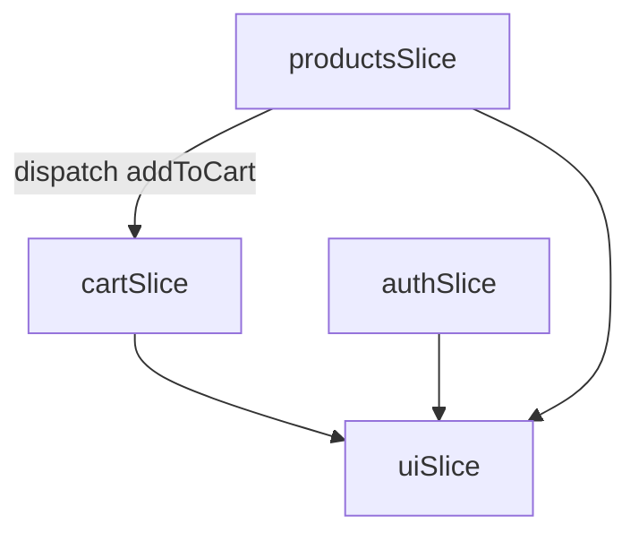

# 🛍️ E‑Commerce Frontend (React + Redux)

A fully‑featured, responsive storefront built with **React 18 + Redux Toolkit**. Browse products, manage a shopping cart and wishlist, authenticate, and explore a polished UI—all powered by a clean, maintainable codebase.


---


## 📸 Demo


> *Coming soon!* Add a short GIF or deploy link (e.g. **Netlify**, **Vercel**, or **GitHub Pages**) showcasing browsing and cart workflows.

---

## ✨ Features

| Category                | Highlights                                                                                      |
| ----------------------- | ----------------------------------------------------------------------------------------------- |
| **Product Exploration** | List, search, filter by category/gender, sort by price ⁄ rating, quick‑view modal               |
| **State Management**    | **Redux Toolkit** slices (`products`, `cart`, `auth`, `ui`), persisted cart via `redux‑persist` |
| **API Handling**        | Typed Axios layer with interceptors, optimistic UI, toast notifications, retry logic            |
| **UI / UX**             | Bootstrap 5 grid, custom CSS modules, dark‑mode toggle, skeleton loaders, lazy‑loaded images    |
| **Auth Flow**           | JWT login/register (mock or real), protected routes, role‑based UI                              |
| **Performance**         | Code‑splitting with `React.lazy`, memoised selectors, Lighthouse‑friendly images                |
| **Testing**             | Jest + React Testing Library ready (unit & integration)                                         |

---

## 🛠️ Tech Stack

* **HTML / CSS / JavaScript**
* **Bootstrap 5** & custom SCSS (no Tailwind)
* **React 18** with Vite
* **Redux Toolkit & Redux Persist**
* **React Router DOM v6**
* **Axios** for HTTP
* **ESLint + Prettier** for a consistent code style

---

## 📂 Folder Structure

```
frontend/
├── public/
├── src/
│   ├── api/          # Axios base & endpoints
│   ├── app/          # Redux store setup
│   ├── components/   # Re‑usable UI atoms/molecules
│   ├── features/     # Redux slices + connected components
│   │   ├── auth/
│   │   ├── cart/
│   │   └── products/
│   ├── hooks/        # Custom React hooks
│   ├── pages/        # Route pages (Home, Product, Cart…)
│   ├── routes/       # Protected & public route wrappers
│   ├── styles/       # Global & theming
│   ├── utils/        # Helpers (formatCurrency, debounce…)
│   └── main.jsx
├── .env.example
└── package.json
```

---

## 🚀 Getting Started

### Prerequisites

* **Node.js** ≥ 18
* **npm** ≥ 9 / **pnpm** ≥ 8

### Installation

```bash
# 1. Clone the repo
$ git clone https://github.com/<your_username>/<repo_name>.git
$ cd <repo_name>

# 2. Install dependencies
$ npm install

# 3. Configure environment variables
$ cp .env.example .env
#   └─ Edit `VITE_API_BASE_URL` etc.

# 4. Start the dev server
$ npm run dev
```

Visit `http://localhost:5173` and happy hacking! ✨

### Production build

```bash
npm run build   # Generates optimised static files
npm run preview # Serve the build locally
```

---

## ⚙️ Environment Variables

| Variable            | Purpose                           | Example                     |
| ------------------- | --------------------------------- | --------------------------- |
| `VITE_API_BASE_URL` | Base URL for product API          | `https://fakestoreapi.com/` |
| `VITE_JWT_SECRET`   | (If self‑hosting auth) JWT secret | `supersecret123`            |

---

## 🏪 Sample API Endpoints

| Action             | Method & URL        |
| ------------------ | ------------------- |
| Get all products   | `GET /products`     |
| Get single product | `GET /products/:id` |
| User login         | `POST /auth/login`  |
| Add to cart        | `POST /cart`        |

Feel free to swap in **Fake Store API**, **Stripe**, or your own backend.

---

## 🗄️ Redux Store Overview



```txt
src/app/store.js
└── Combines slices: { products, cart, auth, ui }
```

Each slice has **actions**, **reducers**, and **async thunks** for API calls (e.g., `fetchProducts`, `loginUser`). Selectors expose derived state with `reselect`.

---

## 📜 Available Scripts

| Script            | Purpose                               |
| ----------------- | ------------------------------------- |
| `npm run dev`     | Start Vite dev server with hot reload |
| `npm run build`   | Production build (ESM & legacy)       |
| `npm run preview` | Preview built site locally            |
| `npm run test`    | Run unit and integration tests        |
| `npm run lint`    | Lint with ESLint & Prettier           |

---

## 🤝 Contributing

1. **Fork** the project
2. Create your **feature branch** (`git checkout -b feature/AmazingFeature`)
3. **Commit** your changes (`git commit -m 'feat: Add amazing feature'`)
4. **Push** to the branch (`git push origin feature/AmazingFeature`)
5. Open a **Pull Request**

### Code of Conduct

Be respectful. Be inclusive. Keep it classy.


## 🙏 Acknowledgements

* [Fake Store API](https://fakestoreapi.com/)
* [Bootstrap](https://getbootstrap.com/)
* [Redux Toolkit](https://redux-toolkit.js.org/)
* [Vite](https://vitejs.dev/)

> *Crafted with ❤️ by **Jaibhim Bangrey***

